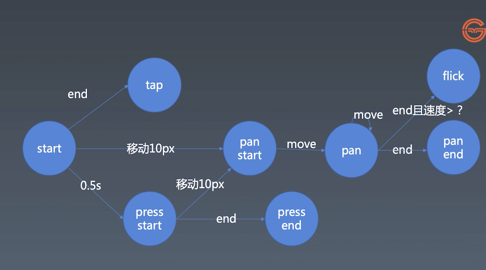

学习笔记

# 组件化

## 手势与动画


### 初步建立动画和时间线

#### JavaScript中处理针的方案

```javascript
setInterval(() => {}, 16);

let tick = () => {
  setTimeout(tick, 16);
}

let tick = () => {
  requestAnimationFrame(tick);
}

// 推荐使用tick
```


### 设计时间线的更新

### 给动画添加展厅和重启功能

### 完善动画的其他功能

### 对时间线进行状态管理

### 手势的基本知识

##### 怎么区分点击与手势

start ----> end  ----> tab

|----> 移动10px ---> panStart(移动摄像机) ---> move ---> pan(Move) ---> end ---> panend

|                                |移动10px                                                                          |--- end且速度> ? ---> flick(swipe)

|---> 0.5s ---> pressStart ---> end ---> pressend



- 触屏移动经验数据
  - Retina 10px
  - 一倍屏幕 5px
  - 三倍屏 15px


### 实现鼠标操作

### 实现手势的逻辑

### 派发事件

### 实现一个Flick事件


